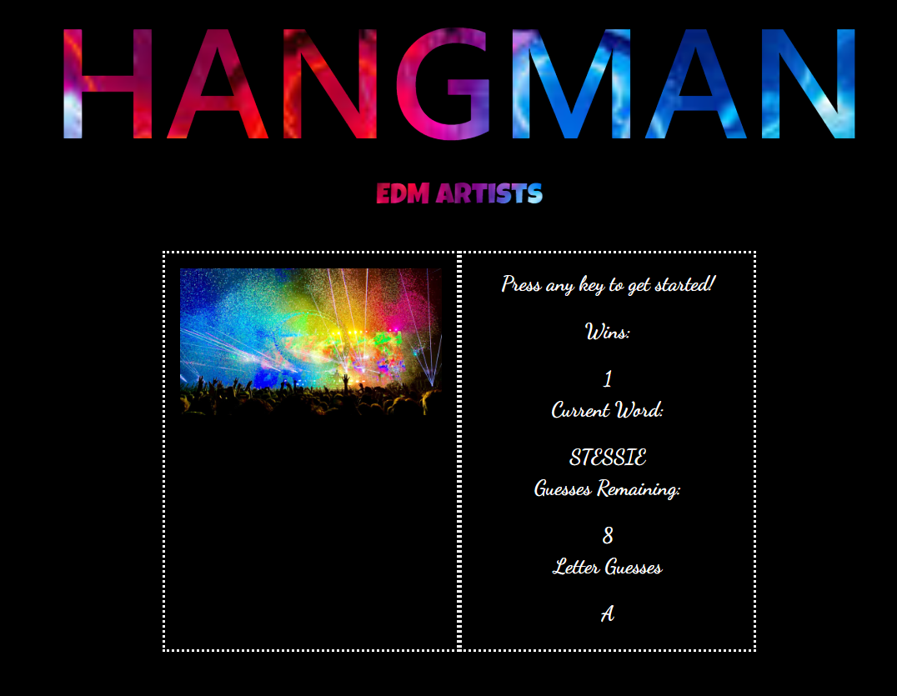
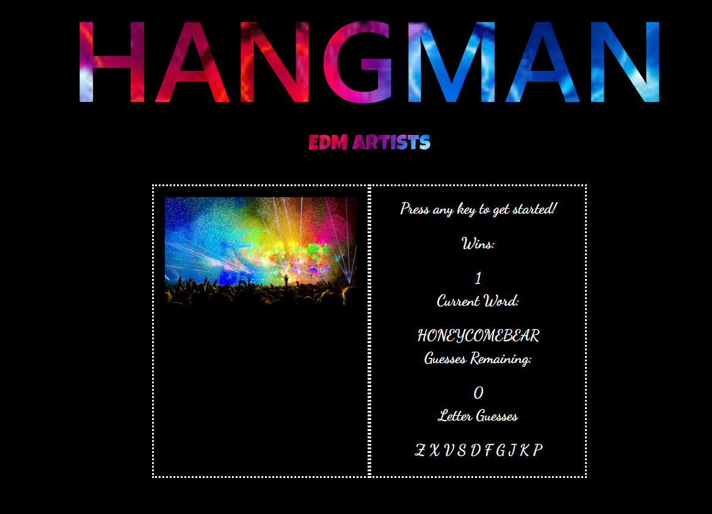

# Word-Guess-Game

Project Link: https://kennedyaustin.github.io/Word-Guess-Game/

# Project Description

In this project CSS, HTML, and Javascript were all used in order to create a word guessing game. The functionality of the game itself is from the Javascript. The game looks for user key presses to determine whether or not the letter is part of the current word. If too many wrong guesses are typed in the user will lose, and if they guess correctly a new word will appear for them to continue playing.

# How to Play

● The user will open up the page to see a screen with a certain number of blank spaces as well as text telling them to press on any key to begin.   
  

● When the user presses a key it will either be added to the blank spaces if it is correct, or down below in the Letters Guessed section.   
  - Incorrect:   
  

  - Correct:   
  

● If the user guesses all of the letters that are in the word correctly their win counter will increase by one, whereas if they lose the word that they were guessing will be shown for a moment before moving onto the next word.  
  - Win:   
  

  - Loss:   
  

# Additional Information

● The JS is coded to only take in letters a-z and A-Z, just in case caps lock is accidentally pressed. Shift and Enter are also choices that the user cannot use as input, so pressing these will not result in the loss of another guess.  
● The letters that are in the letters guessed section will only decrease your total number of guesses by one, meaning that if you press the same letter again by accident you will not be penalized.  
● The JS code currently will not limit the number of wins that the user can achieve, and there is only a small pool of unknown words to be guessed.
